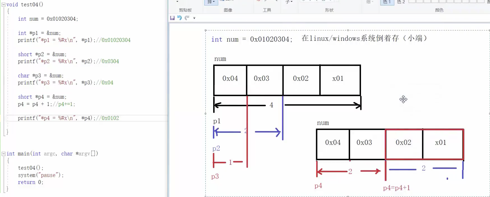

# 指针

## 第一章

1. 指针 数组 字符串
2. 堆内存 栈内存
3. GDB 调试工具

## 第二章

1. ```
   void change(int *a,int b)  其中a为指针参数，*+任意参数或者变量均为指针参数或者变量  在调用该函数时需要在参数前+& 即：  change(&a,&b);
   
   变量前加*号表示加入指针。 在main函数中引用指针时是变量前加&号
   
   int *a=&b; a是指针，把b的地址赋给a，a指向b
   
   &取地址符
   
   指针变量不赋初值会出错，temp
   ```

## 第三章

1. 在c语言中 sum（a，b）；
   如果a b 是数字 那么只会给数字调用进去
   所以就要用指针类型了 这样给的就是地址。

1. ```
   1.编译命令：gcc -g main.c -o main.out；
   2.调试命令：gdb ./main.out；
   3.调试器：(gdb)list:列出源代码；(gdb)break line-number:在指定行数打断点;(gdb)start：开启单步调试；
   (gdb)p a:打印a变量在内存中的情况；(gdb)n:执行到下一句;(gdb)s:进入函数内部；(gdb)bt:查看函数堆栈；
   (gdb)f 1:切换到编号为1的函数中；(gdb)q:退出调试；
   ```

2. 1. a地址
   2. *a a指向的地址处的值vim 

## 第四章

1. 一个十六进制的数字，就可以表示四位二进制的数字

2. ```
   CPU用地址总线寻址,有多少地址总线,就有多少种状态,就能寻找和使用多大的内存
    32bit CPU: 2^32 bit== 4GB
    64bit CPU: 2^64 bit
   
    内存分配
    系统内核（48位以上）
    -------------------------------------------
    栈（暂时存储首先执行的程序状态）
    ------------------------------------------
    自由可分配内存（可动态分配内存）
    -----------------------------------------
    堆
    ----------------------------------------
    数据段（声明一些全局变量或者声明一些常量）
    ----------------------------------------
    代码段（程序源代码编译后存放在此）
   ```

3. 指针本质上就是地址

   

4. ```
   1.GCC会对内存变量分配进行优化：同一种变量类型会放到一块儿！<br>
   2.静态变量、常量、全局变量存于内存的数据段（数据段位置高于代码段）。
   3.64位计算机中：地址都是用64bit表示的，所以指针（存储地址）占64bit，即8字节。
     注意图中：&pa -> &pb的确是增加了8个字节（16进制中满16进1）；
     同理：从de18 -> de20也是增加了8个字节。
   4.栈区域（最接近系统控制的内存空间）保存的是函数的运行状态：函数执行到哪一个命令？每一个变量保存的什么值？等等
   5.在代码段和数据段（区），内存是从低地址向高地址转移的，即：先声明的函数地址小，后声明的函数地址大；而在栈中，刚好相反。
   ```

5. ```
   20161011 C语言指针和内存4-1 数据表示方法
   内存：一个字节8个2进制
   32位操作系统(32个地址总线，2的32次幂 2的30次方1024的3次方，就是1G)做多使用4G内存
   64位操作系统(2的30次方 =G，2的40次方=T)0xffffffffffffffff - 0x0
   
   内存的管理由操作系统管理，给内存编号，给内存进行规划
    1）0x7fffffffffffffff - 0x0为用户使用的内存。
     2）其他~0xffffffffffffffff为操作系统内核使用)
   
   	例子
   	p pa 
    	 0xffffffffffffddfc//pa里保存的内容（内容的内存地址）
   	p &pa
   	 0xffffffffffffde08// 指针 pa的内存地址
   	指针8个字节 本质上保存的是内存的地址：
   		变量：a=第五个柜子第二个抽屉
    		指针  b:第一个柜子第一个抽屉 内容 ：第五个柜子第二个抽屉)
   
   系统内核
   栈
   	(高地址段 先进后出 记录程序已经执行的信息，P &a ,"& '取地址'运算符 " &a表示显示变量a的内存地址空间，）
   
   自由可分配内存
   堆()
   数据段(全局变量,常量,静态变量)
   代码段(低地址段 编译后的程序的机器码保存位置)
   
   C语言不允许直接操作代码段
   为static变量也就是静态变量，在程序运行过程中被声明后就会一直保存在内存里，所以只能声明一次，第二次再访问那个函数时，给静态变量声明同时赋值的语句就不再执行了，而静态变量的值始终保存在内存里，也就是上次改变以后的值。
   没有static修饰的函数中的变量，只在函数被执行时占用内存，函数执行完毕后就被销毁，数据也就不存在了，所以每次都要声明，值也就不会变。
   ```

6. 

## 新增

- char str[] = "hello"
  sizeof(str) 值为6，因为hello每一个为1 但是他还有个一个结束符0所以就是5+1=6
  所以返回一个6并不是5
  空格也算一个字符
- int的每个值都是4
- int a = [1,2,3,4]
  一共有4个 那就是4*4=16
- int *p =&num ;
  int *p;  *p是一个指针变量
  &num 是变量num的起始地址，
  p = &num ; num的地址 与 指针变量p 建立关系



