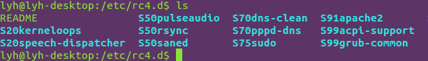
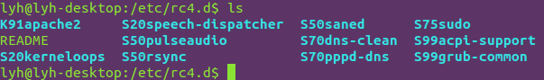

## ubuntu安装php

先装apache再装php

`sudo apt-get install apache2`

`apt-get -y install php7.0`

```csharp
apt-cache search libapache2-mod-php ## 适合PHP7的插件，可以搜索到libapache2-mod-php7.0
sudo apt-get install libapache2-mod-php7.0 ## 让Apache能够识别解析PHP文件
```

在浏览器中输入localhost查看apache是否开启

## ubuntu命令行控制apache启动停止重启配置

https://www.cnblogs.com/supe/p/8010612.html

启动

`$ sudo /etc/init.d/apache2 start`

停止

`$ sudo /etc/init.d/apache2 stop`

重启

`$ sudo /etc/init.d/apache2 restart`

## ubuntu关闭apache自启动

https://www.cnblogs.com/UnGeek/p/5547435.htmletc 

目录下有几个 文件夹： rc0.d    rc1.d   rc2.d  rc3.d  等等（注意，这几个目录下的文件都是链接文件）

cd rc3.d  依次进入每一个目录 ，通过  ls 命令察看当前目录文件：



找到apache的文件，在我的目录下是这样一个文件：  S91apache2  以S开头表示在开机的时候会自动启动

通过命令： sudo mv S91apache2 K91apache2   将其重命名为：K91apache2  以大写的K开头的，表示开机的时候不会启动，

这一点知识参见：http://linux.chinaitlab.com/set/894157.html     （linux开机启动详解）

改名后如下图：



记住，进入每一个rc.d的目录将apache相关的所有文件都改为以大写的K开头

重启系统，通过 ：  ps  -A  察看所有进程

这时，apache服务就没有开机自动启动了。

## ubuntu系统运行级别